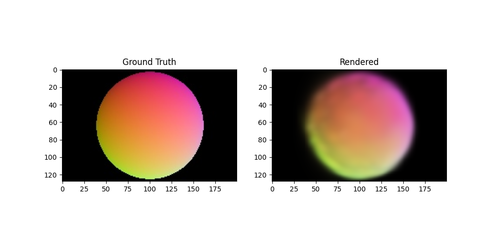

# Tiny-3DGS

This is a simple PyTorch implementation of 3D Gaussian Splatting for novel view synthesis, based on the paper ["3D Gaussian Splatting for Real-Time Radiance Field Rendering"](https://repo-sam.inria.fr/fungraph/3d-gaussian-splatting/) by Kerbl et al. This implementation is meant for educational purposes and is not optimized for performance - it is intentionally slow and simple to help understand the core concepts. Written mostly for my own learnings.

## FAQ

| Question | Answer |
|----------|--------|
| Is it fast? | No |
| Does it have a lot of features? | No |
| Do you have metrics comparing to other implementations? | No |
| Does it work well on big datasets? | No |
| Should I use this in production? | No |
| Is it simple? | **YES!** |

## Features

- Loads COLMAP format datasets
- Implements 3D Gaussian representation with means, scales, rotations, colors, and opacities
- Basic rendering pipeline with back-to-front sorting
- Training loop with visualization of intermediate results
- Export to PLY format for visualization in standard 3D viewers
- Includes a synthetic sphere dataset generator for testing

## Requirements

- Python 3.9+
- PyTorch 2.0+
- NumPy
- OpenCV
- PLYFile
- Matplotlib
- pycolmap

Install the requirements:
```bash
pip install -r requirements.txt
```

## Quick Start Example

To get started quickly, you can use the included synthetic sphere dataset which helps training converge very quickly with very few splats:

```bash
# Generate a synthetic sphere dataset
python generate_sphere_dataset.py

# Train the model on the sphere dataset
python train.py --num_epochs=50 --num_gaussians=100 --dataset_path=data/sphere --learning_rate=0.02
```




## Usage with Custom Datasets

1. Prepare your dataset in COLMAP format:
   - Images should be in an `images` directory (implementation will also search for "images_*" to look for downscaled imagery)
   - COLMAP reconstruction should be in a `sparse/0` directory
   - Required files: `cameras.txt`, `images.txt`

2. Train the model:
```bash
python train.py --dataset_path /path/to/colmap/dataset \
                --num_gaussians 1000 \
                --num_epochs 100 \
                --batch_size 1 \
                --learning_rate 0.001 \
                --output_dir output
```

Arguments:
- `--dataset_path`: Path to the COLMAP dataset directory
- `--num_gaussians`: Number of 3D Gaussians to use (default: 1000)
- `--num_epochs`: Number of training epochs (default: 100)
- `--batch_size`: Batch size for training (default: 1)
- `--learning_rate`: Learning rate for optimization (default: 0.001)
- `--output_dir`: Directory to save results (default: "output")

## Output

The training script will:
1. Save intermediate rendered images every epoch
2. Save the model as a PLY file every epoch
3. Show a progress bar with the current loss

The PLY files can be visualized using standard 3D viewers like MeshLab or Blender. For a quick web-based viewer, you can use [SuperSplat](https://superspl.at/editor).

## Implementation Details

The implementation consists of four main components:

1. `data_loader.py`: Handles loading and preprocessing of COLMAP format datasets
2. `gaussian_model.py`: Implements the 3D Gaussian representation and parameter management
3. `renderer.py`: Implements the basic rendering pipeline for novel view synthesis
4. `train.py`: Main training script that ties everything together
5. `generate_sphere_dataset.py`: Generates a synthetic sphere dataset for testing

## Educational Purpose

This implementation is designed to be simple and educational rather than efficient. Key aspects that make it suitable for learning:

1. Simple, unoptimized rendering pipeline that's easy to understand
2. Basic back-to-front sorting without complex optimizations
3. Straightforward Gaussian parameter management
4. Clear visualization of intermediate results
5. Synthetic dataset generator for easy testing

Note that this implementation is intentionally slow and not optimized for performance. For production use, consider using the official implementation or other optimized versions. 